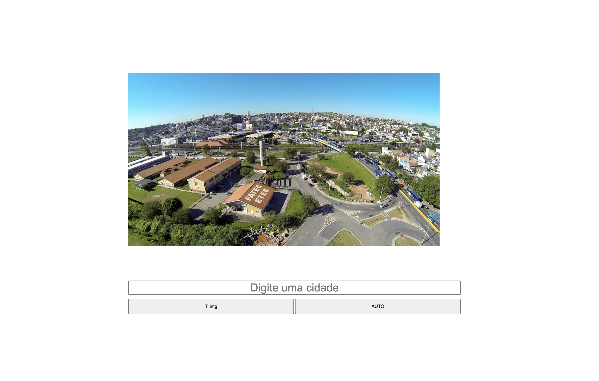

# Site cidade

## Site
É um site feito com Html, CSS e JS, que você pode trocar a imagem da cidade de fundo apenas digitando o nome da cidade que você preferir.

## Tecnologias utilizadas para criar o site
* HTML
* CSS
* JS

## Autor
[Gustavo Pereira](https://www.linkedin.com/in/gustavo-pereira-dev-redes)
